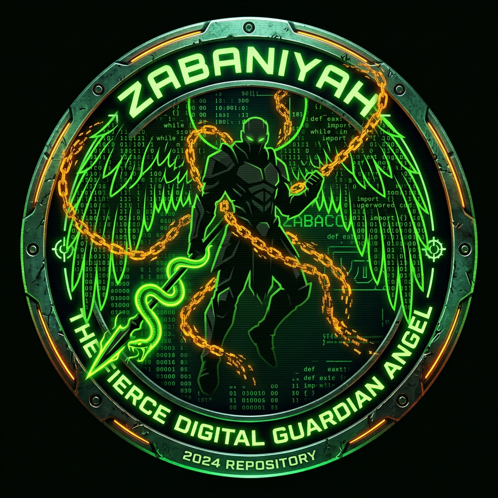

<p align="center">
  
</p>

<h1 align="center">⚡ ZABACODE ⚡</h1>

<p align="center">
  <b>The Uncompromising, Standalone Anti-Capitalist Mobile Python IDE & AI Code Assistant</b><br>
  <i>Offline-first, Zero Telemetry, 7 AI Providers + Zaba Oracle — Built for Android ARMv7 / ARM64</i>
</p>

<p align="center">
  <a href="https://github.com/muzape28-blip/ZABACODE/actions/workflows/build_apk.yml"></a>
  <a href="https://github.com/muzape28-blip/ZABACODE/releases"></a>
  <a href="LICENSE"></a>
  
  
  
  
  
</p>

---

```
┌─────────────────────────────────────────────────────────────────────────────┐
│  ZABACODE v1.2.0 — WebView Shell + Modular Python Core                    │
│  [ OK ] Ace Editor 1.32.4 Bundled (100% Offline, 45-60 FPS)               │
│  [ OK ] Modular Core Engine + Isolated Subprocess Runner (Timeout+PGID)  │
│  [ OK ] Android Keystore + Authenticated Key Vault (AES-GCM)             │
│  [ OK ] PyPI Wheel Extractor (Verified TLS + certifi + SHA-256)          │
│  [ OK ] 7 AI Providers: OpenRouter/Gemini/Groq/Mistral/DeepSeek/Ollama/Custom │
│  [ OK ] Zaba Oracle — Offline Code Intelligence (No Key, No Network)     │
│  [ OK ] Custom Endpoint — OpenAI-compatible URL, Verified TLS            │
│  [ OK ] Theme Engine (10 Themes: Tokyo Night, Catppuccin, Dracula...)    │
│  [ OK ] Plugin Marketplace (12+ Plugins, 8 Snippets, 5 Transform)         │
│  [ OK ] Security: CSP, X-Content-Type-Options, Loopback-Only Server      │
│  > WORKSPACE READY. HAPPY MOBILE CODING!                                  │
└─────────────────────────────────────────────────────────────────────────────┘
```

---

## 🏛️ Philosophy

**ZABACODE** — inspired by **Zabaniyah**, the uncompromising guardians.

In a mobile ecosystem full of ads, paywalls, and telemetry, ZABACODE is an anti-capitalist statement:

* **100% Free & GPLv3 Open Source**
* **Zero Ads, Zero Pop-ups**
* **Zero Telemetry / Zero Tracking**
* **Offline-first — works in airplane mode**
* **Community-owned — no single tool permanently branded into identity**

---

## 🚀 Key Features (v1.2.0)

### 🔮 0. Zaba Oracle — Offline Code Intelligence

Other IDEs die without internet. ZABACODE doesn't.

* **Traceback Humanizer** — 20+ error families auto-translated to plain English with concrete fix, inline in terminal. Line numbers mapped to your editor (not prelude).
* **Offline Code Review** — AST-based detection: deep nesting, bare `except:`, mutable defaults, unreachable code, static `10/0`, security risks (`eval`, `exec`), missing docstrings, TODOs.
* **Graceful Fallback** — When cloud provider is rate-limited / no key / offline, Oracle answers. You never stare at a dead chat window.

```
🔮 Reached Past the End of a List          [OFFLINE]
   You asked for index 10 but list has only 3 items (0,1,2).
   Fix: Guard with `if i < len(my_list):` or use `for item in my_list:`
   Line 2
```

### 🔧 1. Custom Endpoint — Bring Your Own LLM (NEW in v1.2.0)

Genuinely useful feature, not branding:

* **How it works:** Put URL in API key field, e.g. `https://api.your-server.com/v1` or `http://192.168.1.10:11434/v1`
* **What it does:** ZABACODE normalizes to `/v1/chat/completions` and calls it with **verified TLS** via `get_ssl_context()` + `certifi` bundle
* **Supports:** OpenAI-compatible APIs (OpenRouter self-hosted, vLLM, LocalAI, Ollama with OpenAI compat, etc.)
* **Why keep it:** Allows self-hosting, local network LLMs, and avoids vendor lock-in — aligns with anti-capitalist philosophy
* **Offline intelligence stays Oracle** — Oracle is the true offline brain, custom endpoint is optional online extension

### 🛠️ 2. System Settings Dashboard

Clean sidebar:

* 🧩 Plugin & Theme Marketplace
* 📂 Open / Manage Files
* 💾 Save As File (.py)
* 🛠️ Settings & Preferences → full-screen dashboard:
  - 📦 Library Manager (zabapip)
  - 🚀 Offline Starter Kits (To-do, Safe Calculator, HTTP)
  - ⚙️ Editor Engine Switcher (Ace / Native fallback)
  - 🎨 Themes (10 presets)
  - 📺 CRT Scanlines Toggle
  - 🔑 AI API Keys (encrypted at-rest)

### 📦 3. Library Manager — Verified & Secure

**Not a bypass — verified security:**

* **Verified TLS** via `zabacode/core/net.py` + `certifi` + `openssl` (in `buildozer.spec`)
* **SHA-256 wheel verification** against PyPI's published hash — no MITM → RCE
* **Path validation** — archive members checked, no traversal
* **50+ libraries** cataloged with `tier` (runtime/buildtime) and `mode` (offline/online/hybrid)

### 📝 4. Ace Editor — Bundled Offline

* **Ace 1.32.4 bundled** in `assets/vendor/ace/` — no CDN, genuinely offline
* 45-60 FPS on mobile vs Monaco's 15-30 FPS
* Touch-friendly context menu (Undo, Redo, Find, Palette)
* Multi-tab with 500ms auto-save debounce, native fallback editor
* Symbol quick bar for mobile: `TAB : ( ) [ ] { } " ' = _ def return import`

### ⚙️ 5. Interactive Execution Engine — Isolated Subprocess

* **Isolated subprocess** with timeout (30s default) + process-group cleanup — no main thread blocking
* **Real-time streaming:** `/api/run/interactive/start|output|input|stop`
* **STDIN support:** type input while program runs, live char streaming
* **EXECUTE doubles as STOP** while process runs
* **Secure:** filename validation, size limits, no traversal, Android backup disabled

### 🧩 6. Transform Plugins (v1.1.0) — Offline AST

5 high-fidelity offline plugins via `PluginExecutor`:

* 🚀 **Auto-Import Optimizer:** comments out unused imports (AST)
* 🔍 **Duplicate Line Detector:** flags DRY violations
* ✍️ **Smart Comment Generator:** PEP-257 docstrings with Args/Returns
* 🎨 **Code Beautifier Pro:** PEP-8 spacing, preserves strings/comments
* 💡 **Type Hint Generator:** infers from defaults, adds `from typing import Any` if needed

Activate via Marketplace → instantly transforms active editor buffer.

---

## 📊 Comparison

| Feature | Pydroid 3 | Acode | ZABACODE v1.2.0 |
| :--- | :--- | :--- | :--- |
| **License** | Freemium / Paywall | Paid | **GPLv3 100% Free** |
| **Ads / Telemetry** | Ads + Trackers | Analytics | **ZERO** |
| **Python Engine** | Native | Needs Termux | **Isolated Subprocess Sandbox** |
| **UI Engine** | IDLE Style | Ace/Monaco | **WebView + Ace Bundled Offline** |
| **AI Providers** | None | None | **7 (OpenRouter/Gemini/Groq/Mistral/DeepSeek/Ollama/Custom) + Oracle** |
| **Offline AI** | None | None | **2 (Ollama, Oracle)** |
| **Library Manager** | Precompiled Wheels | None | **50+ Libs, Verified TLS + SHA-256** |
| **Themes** | Limited | Multiple | **10 incl. Tokyo Night, Catppuccin** |
| **Security** | Basic | Basic | **Loopback-only, Token Auth, Keystore AES-GCM, CSP, Verified TLS** |
| **Arch** | 32/64-bit | - | **Universal Fat APK ARMv7+ARM64** |

---

## 🏗️ Architecture

```
ZABACODE/
├── main.py → WebView shell entry
├── templates/index.html → Ace Editor + UI (offline)
├── assets/vendor/ace/ → Bundled Ace 1.32.4
├── zabacode/
│   ├── web_app.py → Flask + Waitress (127.0.0.1:5000, 4 threads, CSP headers)
│   ├── core/
│   │   ├── executor.py → Isolated subprocess, RLock-guarded InteractiveSession
│   │   ├── ai_provider.py → 7 providers (openrouter/gemini/groq/mistral/deepseek/ollama/custom)
│   │   ├── oracle.py → humanize_traceback, analyze_buffer, offline_reply (true offline brain)
│   │   ├── net.py → shared verified SSL context (certifi)
│   │   ├── keystore.py → authenticated encryption at-rest
│   │   ├── security.py → AUTH_TOKEN, XOR + keystore
│   │   ├── file_manager.py → secure_filename, no traversal
│   │   └── checker.py → syntax/bracket validation
│   ├── lib_manager.py → PyPI extractor, SHA-256 verify
│   ├── plugins/ → registry + 5 transform implementations
│   └── themes/ → 10 theme definitions
├── files/ → user files (gitignored in APK)
└── .github/workflows/
    └── build_apk.yml → Lint (ruff) + Mypy + Pytest + Security checks + APK build
```

---

## 🚀 Quick Start

### Option 1: Download APK (Recommended)
1. https://github.com/muzape28-blip/ZABACODE/releases
2. Download `Zabacode-1.2.0.apk`
3. Install on Android 8.0+ (API 26+)

### Option 2: Dev Server

```bash
git clone https://github.com/muzape28-blip/ZABACODE.git
cd ZABACODE

pip install -r requirements-dev.txt

# Run WebView server
python main.py
# Open http://127.0.0.1:5000 — Ace editor loads offline

# Run tests
pytest test_main.py -v  # 132+ tests
```

### Option 3: Build APK Locally

```bash
pip install buildozer cython==0.29.33
buildozer -v android debug
# APK in bin/
```

`buildozer.spec` already includes `certifi`, `openssl` for TLS.

---

## 🔐 Security

* **Loopback-only server** (`127.0.0.1:5000`) + per-install `X-Zabacode-Token` (constant-time compare)
* **Android Keystore** preferred, in-memory-only fallback
* **Verified TLS** for all HTTPS via `get_ssl_context()` + certifi — no unverified context
* **SHA-256 wheel verification** + path validation
* **CSP headers:** `default-src 'self'; frame-ancestors 'none';` + `X-Content-Type-Options: nosniff`
* **File protections:** no traversal, no dotfiles, no null bytes, size limits
* **Subprocess isolation:** timeout + PGID cleanup
* **Backup disabled:** `android:allowBackup="false"`

See `SECURITY.md`.

---

## 📖 Docs & Roadmap

* `ZABACODEE.md` → Roadmap & Progress Tracker
* `CHANGELOG.md` → Version history
* `CONTRIBUTING.md` → How to contribute
* `SECURITY.md` → Security policy

**Current:** `v1.2.0` (WebView + Oracle + Custom Endpoint)  
**Philosophy:** Tools help debug/review, but identity stays with community — no permanent tool branding in version, credits, or CI gates.

---

## 👥 Core Team

* **[Zaqi (muzape28-blip)](https://github.com/muzape28-blip)** — Creator, Lead Architect
* **Contributors** — Plugin authors, theme designers, security reviewers, bug reporters

---

<p align="center"><b>Built with ❤️ and 🔥 for open-source, offline-first future.</b><br>ZABACODE — Anti-capitalist, Community-owned, Zero Telemetry ⚡</p>
